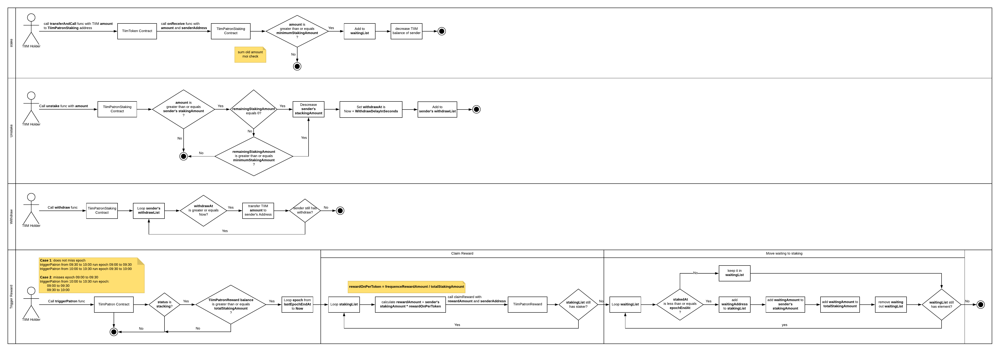
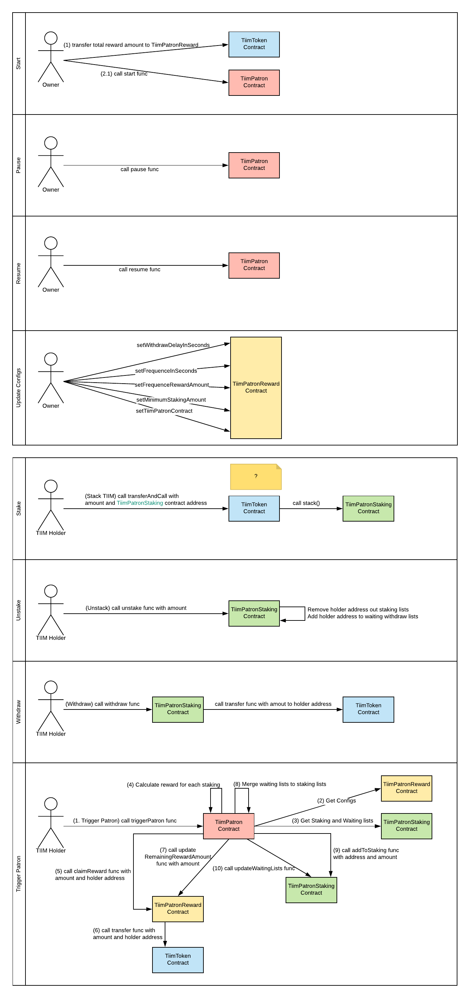

# PATRON

Patrons are TriipMiles holders who believe and support for sustainable growth of travel. A TriipMiles holder becomes a Patron when she/he acquires stake of any amount TriipMiles above 50 in each epoch. A Patron can resign, but the tokens will be locked for the next 7 days after the resignation.

Read more at Triip White Paper => https://docs.google.com/document/d/1gWfbsKigJ5VaWWyQAcrWmpAy_E9GB8a9e0qlzTsVnZo/edit?fbclid=IwAR3KRSDtY5d4JbzO76ItfIEeLj44ezRhUSHoUe6ES9eFvyl1x8GkqMMDbJQ#heading=h.37t42vz0rpve

# Use Case Diagram

# Patron Flow

# Patron Smart Contract interaction
